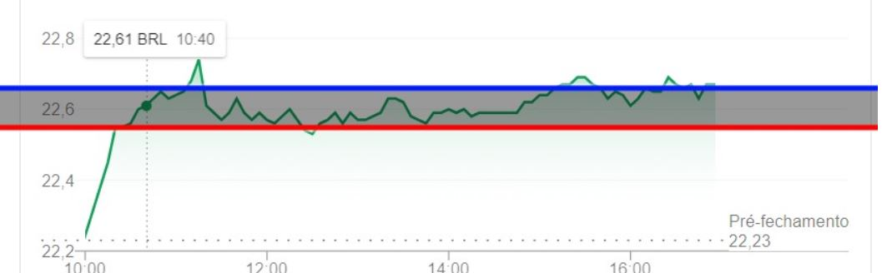

# Stock Warning - Desafio Inoa

### Intro
O objetivo do sistema é avisar, via e-mail, caso a cotação de um ativo da B3 caia mais do que certo nível, ou suba acima de outro.

Construindo, assim, um sistema capaz de acessar uma API para verificar a cotação periódicamente; tão quanto acessar o protocolo SMTP para enviar e-mails, sendo totalmente desenvolvido em C# (.Net).

Nesse projeto fora utilizada a API TwelveData, a qual possibilita avisos de cotações além da B3. Essa API foi escolhida por ser prática de implantar, servir para o propósito do desafio possuindo uma boa documentação e plataforma dedicada às necessidades do desenvolvedor; além da possibilidade de expandir a pesquisa para fora da B3.

Para o envio de e-mail utiliza-se o MailKit acessando SMTP do Gmail.
## Tech Stack

**C#** &
**.Net**

## Where is what
> A chamada inicial do sistema está em _Program.cs_. Enquanto os Controllers estão localizados na pasta Controller.

### Email Configuration
Toda configuração de SMTP, como pedido no desafio, foi criada em um único arquivo para leitura.
Tais configurações estão no appsettings.json
O arquivo Json foi utilizado como uma forma prática de colocar as credenciais e configurações.
Porém, é recomendado que as credenciais e secrets sejam passados de forma indireta ou utilizando variáveis de ambiente.

### TwelveData API
O desenvolvimento da chamada de API está no *Controller/APIController.cs*

### Email SetUp
A função que cria e faz o envio de email está em *Controller/MailController.cs*
    
    No Setup de Emails é possível enviar para mais de uma pessoa ao mesmo tempo e isso pode ser configurado.

### Stock Controller
Visando controlar qual cotação é inserida na chamada da API e que tipo de mensagem é enviada por email, essa função foi criada em *Controller/StockController.cs*.
## Rodar Localmente
Clone o projeto

```bash
  git clone
```

Acesse o diretório

```bash
  cd Inoa-Challenge
```

> - Atualize o appsettings.json para o email de origem (com senha) e o(s) e-mail(s) de destino

---
## Testando

```dotnet
dotnet run petr4 30.2 36.7
```
 
 

- Toda vez que o preço for maior que linha-azul, um e-mail é disparado aconselhando a venda.
- Toda vez que o preço for menor que linha-vermelha, um e-mail é disparado aconselhando a compra.